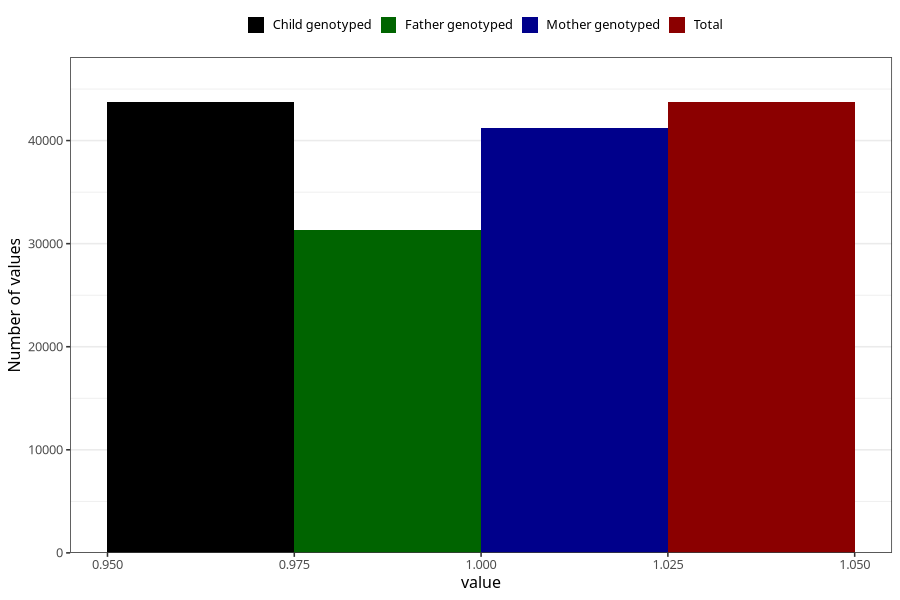

# social_problems_no_18m
Variable mapping to `EE967` in `Skjema5_18mnd_v12`.
- Number of values:

| Value | Total | Child genotyped | Mother genotyped | Father genotyped |
| ----- | ----- | --------------- | ---------------- | ---------------- |
| Missing | 37281 | 37281 | 35356 | 22295 |
| Non-missing | 43724 | 43724 | 41261 | 31309 |
| 1 | 43724 | 43724 | 41261 | 31309 |

