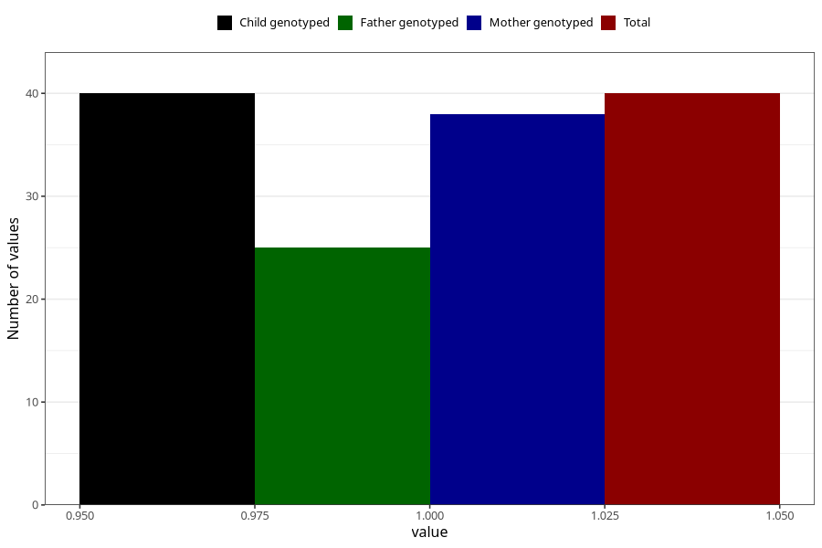

# social_problems_previously_18m
Variable mapping to `EE969` in `Skjema5_18mnd_v12`.
- Number of values:

| Value | Total | Child genotyped | Mother genotyped | Father genotyped |
| ----- | ----- | --------------- | ---------------- | ---------------- |
| Missing | 80965 | 80965 | 76579 | 53579 |
| Non-missing | 40 | 40 | 38 | 25 |
| 1 | 40 | 40 | 38 | 25 |

