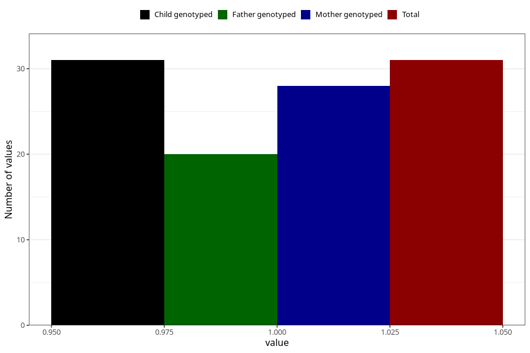

# social_problems_yes_18m
Variable mapping to `EE968` in `Skjema5_18mnd_v12`.
- Number of values:

| Value | Total | Child genotyped | Mother genotyped | Father genotyped |
| ----- | ----- | --------------- | ---------------- | ---------------- |
| Missing | 80974 | 80974 | 76589 | 53584 |
| Non-missing | 31 | 31 | 28 | 20 |
| 1 | 31 | 31 | 28 | 20 |

