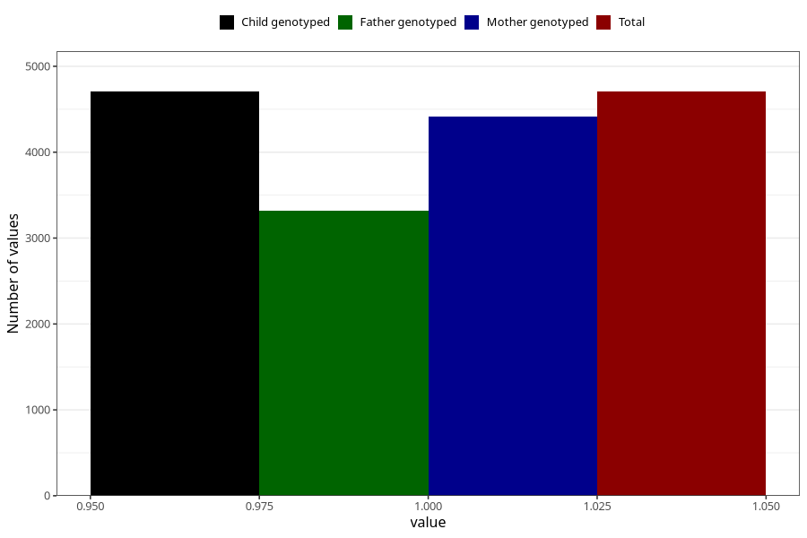

# specialist_diagnosis_1_18m
Variable mapping to `EE861` in `Skjema5_18mnd_v12`.
- Number of values:

| Value | Total | Child genotyped | Mother genotyped | Father genotyped |
| ----- | ----- | --------------- | ---------------- | ---------------- |
| Missing | 76300 | 76300 | 72204 | 50289 |
| Non-missing | 4705 | 4705 | 4413 | 3315 |
| 1 | 4705 | 4705 | 4413 | 3315 |

