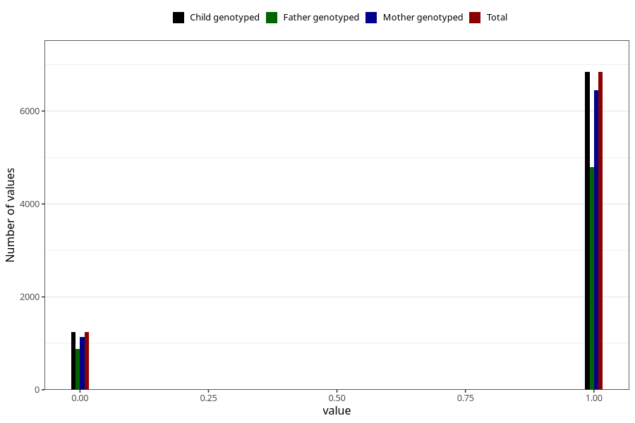

# specialist_diagnosis_1_3y
Variable mapping to `GG118` in `Skjema6_3aar_v12`.
- Number of values:

| Value | Total | Child genotyped | Mother genotyped | Father genotyped |
| ----- | ----- | --------------- | ---------------- | ---------------- |
| Missing | 72928 | 72928 | 69028 | 47942 |
| Non-missing | 8077 | 8077 | 7589 | 5662 |
| 0 | 1238 | 1238 | 1143 | 876 |
| 1 | 6839 | 6839 | 6446 | 4786 |

