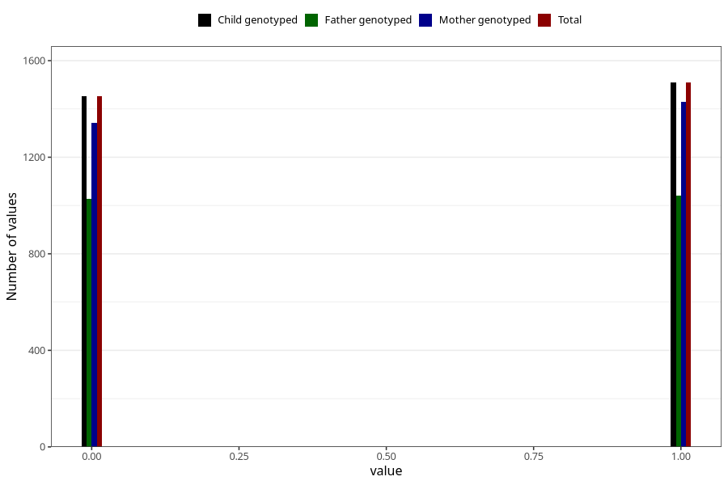

# specialist_diagnosis_2_3y
Variable mapping to `GG120` in `Skjema6_3aar_v12`.
- Number of values:

| Value | Total | Child genotyped | Mother genotyped | Father genotyped |
| ----- | ----- | --------------- | ---------------- | ---------------- |
| Missing | 78042 | 78042 | 73845 | 51537 |
| Non-missing | 2963 | 2963 | 2772 | 2067 |
| 0 | 1454 | 1454 | 1343 | 1026 |
| 1 | 1509 | 1509 | 1429 | 1041 |

