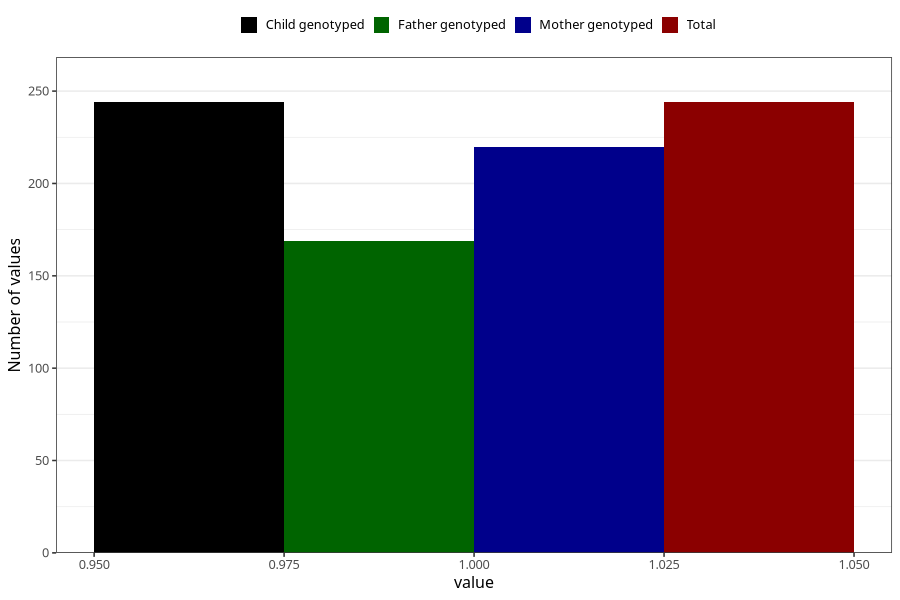

# specialist_diagnosis_3_18m
Variable mapping to `EE864` in `Skjema5_18mnd_v12`.
- Number of values:

| Value | Total | Child genotyped | Mother genotyped | Father genotyped |
| ----- | ----- | --------------- | ---------------- | ---------------- |
| Missing | 80761 | 80761 | 76397 | 53435 |
| Non-missing | 244 | 244 | 220 | 169 |
| 1 | 244 | 244 | 220 | 169 |

