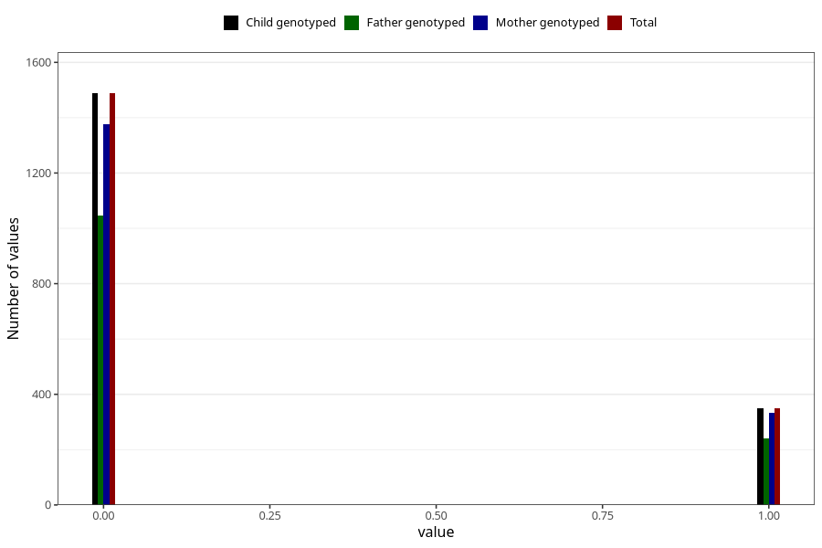

# specialist_diagnosis_3_3y
Variable mapping to `GG122` in `Skjema6_3aar_v12`.
- Number of values:

| Value | Total | Child genotyped | Mother genotyped | Father genotyped |
| ----- | ----- | --------------- | ---------------- | ---------------- |
| Missing | 79166 | 79166 | 74906 | 52317 |
| Non-missing | 1839 | 1839 | 1711 | 1287 |
| 0 | 1488 | 1488 | 1378 | 1047 |
| 1 | 351 | 351 | 333 | 240 |

