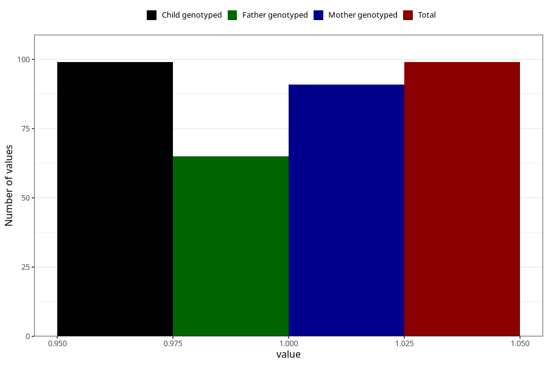

# syndrome_6m
Variable mapping to `DD1110` in `Skjema4_6mnd_v12`.
- Number of values:

| Value | Total | Child genotyped | Mother genotyped | Father genotyped |
| ----- | ----- | --------------- | ---------------- | ---------------- |
| Missing | 80906 | 80906 | 76526 | 53539 |
| Non-missing | 99 | 99 | 91 | 65 |
| 1 | 99 | 99 | 91 | 65 |

