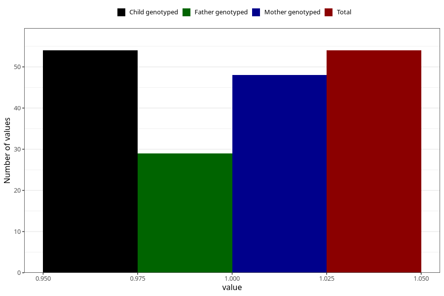

# syndrome_or_chromosomal_defect_name_6m
Variable mapping to `DD1112` in `Skjema4_6mnd_v12`.
- Number of values:

| Value | Total | Child genotyped | Mother genotyped | Father genotyped |
| ----- | ----- | --------------- | ---------------- | ---------------- |
| Missing | 80951 | 80951 | 76569 | 53575 |
| Non-missing | 54 | 54 | 48 | 29 |
| 1 | 54 | 54 | 48 | 29 |

