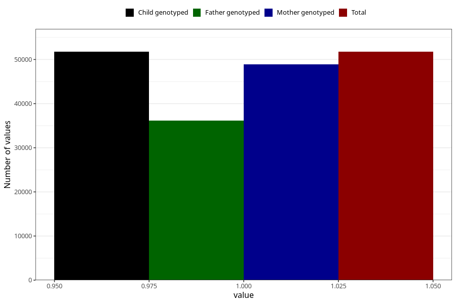

# testicles_not_descended_into_scrotum_no_18m
Variable mapping to `EE819` in `Skjema5_18mnd_v12`.
- Number of values:

| Value | Total | Child genotyped | Mother genotyped | Father genotyped |
| ----- | ----- | --------------- | ---------------- | ---------------- |
| Missing | 29255 | 29255 | 27685 | 17472 |
| Non-missing | 51750 | 51750 | 48932 | 36132 |
| 1 | 51750 | 51750 | 48932 | 36132 |

