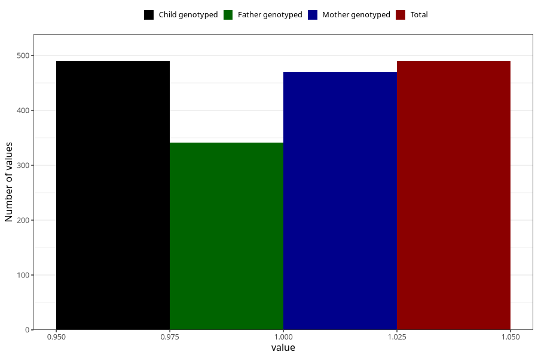

# testicles_not_descended_into_scrotum_previously_18m
Variable mapping to `EE821` in `Skjema5_18mnd_v12`.
- Number of values:

| Value | Total | Child genotyped | Mother genotyped | Father genotyped |
| ----- | ----- | --------------- | ---------------- | ---------------- |
| Missing | 80515 | 80515 | 76147 | 53263 |
| Non-missing | 490 | 490 | 470 | 341 |
| 1 | 490 | 490 | 470 | 341 |

