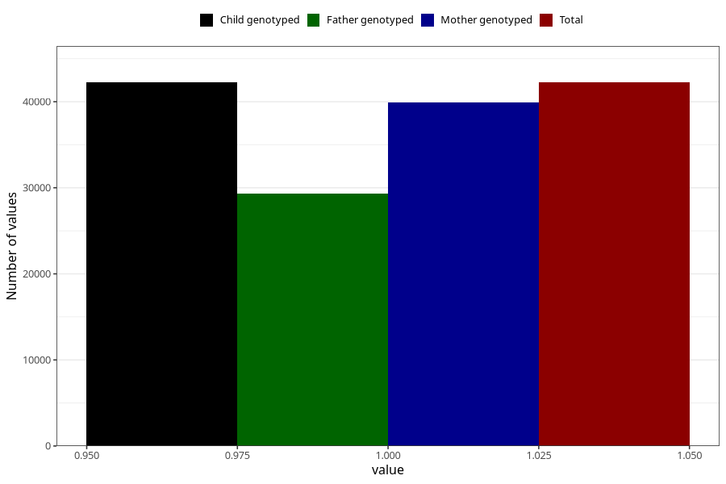

# testicles_not_descended_scrotum_no_3y
Variable mapping to `GG65` in `Skjema6_3aar_v12`.
- Number of values:

| Value | Total | Child genotyped | Mother genotyped | Father genotyped |
| ----- | ----- | --------------- | ---------------- | ---------------- |
| Missing | 38766 | 38766 | 36675 | 24250 |
| Non-missing | 42239 | 42239 | 39942 | 29354 |
| 1 | 42239 | 42239 | 39942 | 29354 |

