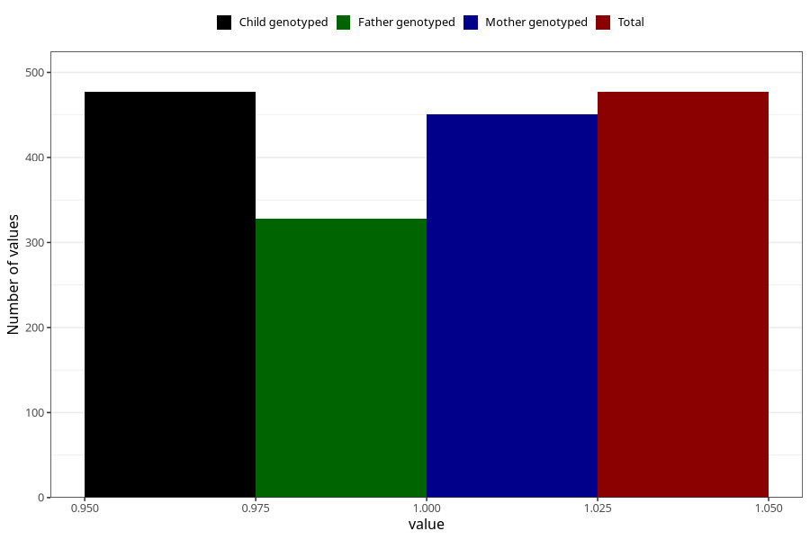

# testicles_not_descended_scrotum_previous_3y
Variable mapping to `GG67` in `Skjema6_3aar_v12`.
- Number of values:

| Value | Total | Child genotyped | Mother genotyped | Father genotyped |
| ----- | ----- | --------------- | ---------------- | ---------------- |
| Missing | 80528 | 80528 | 76166 | 53276 |
| Non-missing | 477 | 477 | 451 | 328 |
| 1 | 477 | 477 | 451 | 328 |

