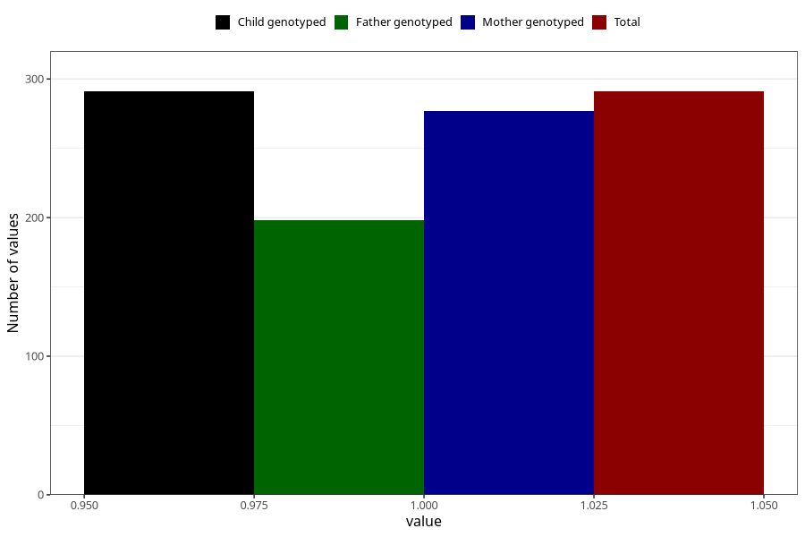

# testicles_not_descended_scrotum_yes_3y
Variable mapping to `GG66` in `Skjema6_3aar_v12`.
- Number of values:

| Value | Total | Child genotyped | Mother genotyped | Father genotyped |
| ----- | ----- | --------------- | ---------------- | ---------------- |
| Missing | 80714 | 80714 | 76340 | 53406 |
| Non-missing | 291 | 291 | 277 | 198 |
| 1 | 291 | 291 | 277 | 198 |

