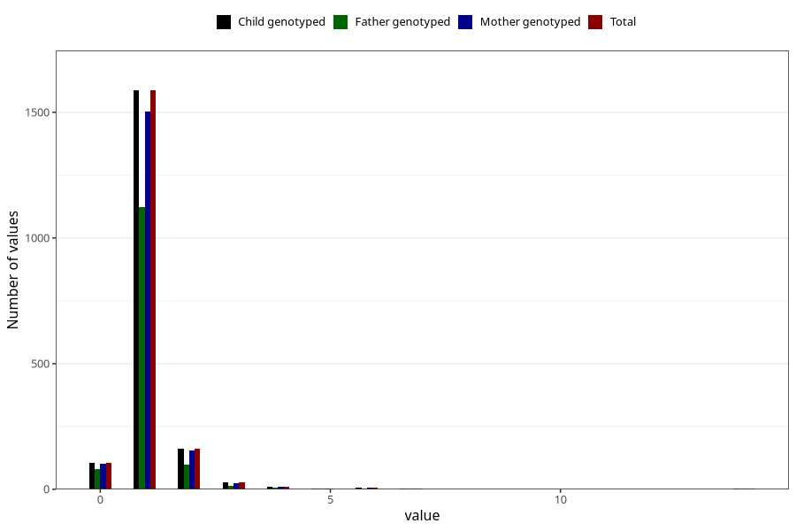

# throat_infection_freq_6m
Variable mapping to `DD268` in `Skjema4_6mnd_v12`.
- Number of values:

| Value | Total | Child genotyped | Mother genotyped | Father genotyped |
| ----- | ----- | --------------- | ---------------- | ---------------- |
| Missing | 79101 | 79101 | 74809 | 52269 |
| Non-missing | 1904 | 1904 | 1808 | 1335 |
| 0 | 106 | 106 | 101 | 79 |
| 1 | 1587 | 1587 | 1502 | 1124 |
| 2 | 160 | 160 | 155 | 97 |
| 3 | 26 | 26 | 25 | 15 |
| 4 | 10 | 10 | 10 | 8 |
| 5 | 2 | 2 | 2 | 2 |
| 6 | 6 | 6 | 6 | 4 |
| 7 | 4 | 4 | 4 | 3 |
| 12 | 1 | 1 | 1 | 1 |
| 14 | 2 | 2 | 2 | 2 |

