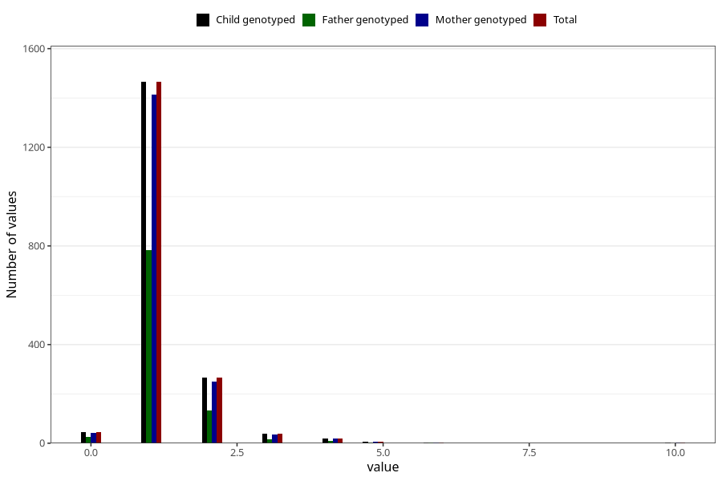

# throat_infection_number_12_18m
Variable mapping to `EE223` in `Skjema5_18mnd_v12`.
- Number of values:

| Value | Total | Child genotyped | Mother genotyped | Father genotyped |
| ----- | ----- | --------------- | ---------------- | ---------------- |
| Missing | 79159 | 79159 | 74844 | 52630 |
| Non-missing | 1846 | 1846 | 1773 | 974 |
| 0 | 45 | 45 | 43 | 27 |
| 1 | 1465 | 1465 | 1412 | 783 |
| 2 | 266 | 266 | 251 | 132 |
| 3 | 39 | 39 | 36 | 17 |
| 4 | 19 | 19 | 19 | 10 |
| 5 | 5 | 5 | 5 | 2 |
| 6 | 4 | 4 | 4 | 2 |
| 7 | 1 | 1 | 1 | 0 |
| 10 | 2 | 2 | 2 | 1 |

