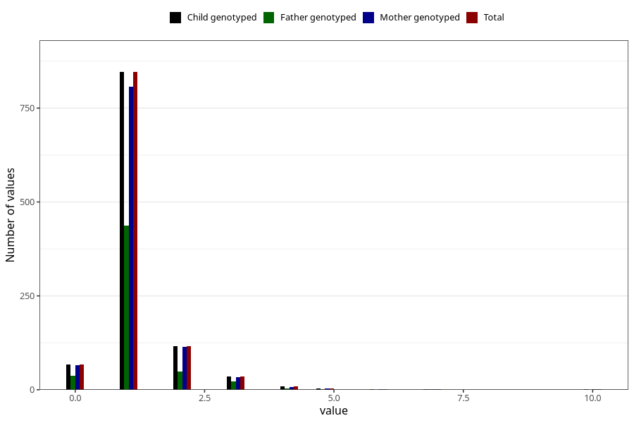

# throat_infection_number_6_11m
Variable mapping to `EE221` in `Skjema5_18mnd_v12`.
- Number of values:

| Value | Total | Child genotyped | Mother genotyped | Father genotyped |
| ----- | ----- | --------------- | ---------------- | ---------------- |
| Missing | 79922 | 79922 | 75581 | 53051 |
| Non-missing | 1083 | 1083 | 1036 | 553 |
| 0 | 67 | 67 | 65 | 38 |
| 1 | 846 | 846 | 807 | 438 |
| 2 | 117 | 117 | 114 | 49 |
| 3 | 35 | 35 | 33 | 22 |
| 4 | 9 | 9 | 8 | 3 |
| 5 | 4 | 4 | 4 | 2 |
| 6 | 1 | 1 | 1 | 0 |
| 7 | 2 | 2 | 2 | 1 |
| 10 | 2 | 2 | 2 | 0 |

