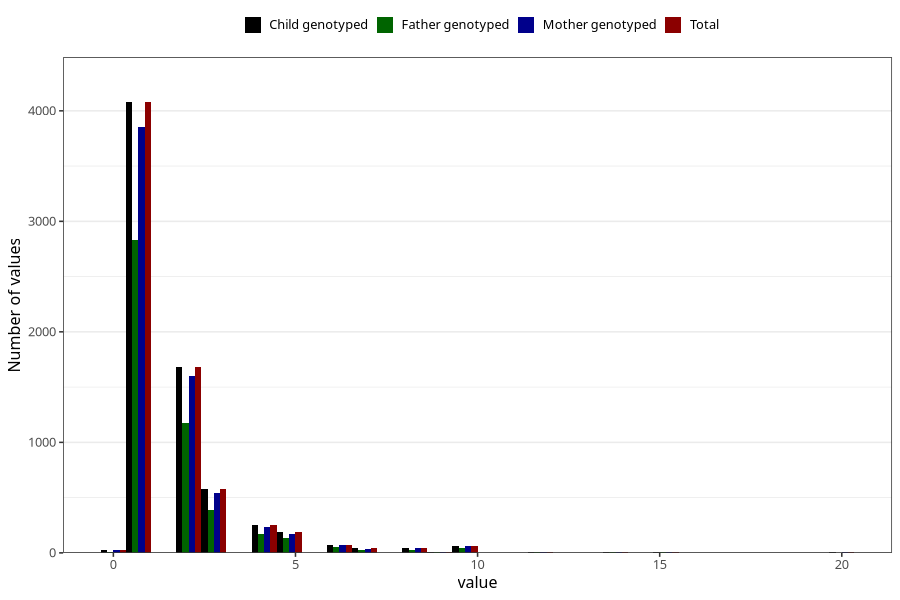

# throat_infection_other_freq_3y
Variable mapping to `GG135` in `Skjema6_3aar_v12`.
- Number of values:

| Value | Total | Child genotyped | Mother genotyped | Father genotyped |
| ----- | ----- | --------------- | ---------------- | ---------------- |
| Missing | 73942 | 73942 | 69941 | 48712 |
| Non-missing | 7063 | 7063 | 6676 | 4892 |
| 0 | 24 | 24 | 23 | 12 |
| 1 | 4078 | 4078 | 3855 | 2832 |
| 2 | 1686 | 1686 | 1600 | 1176 |
| 3 | 575 | 575 | 539 | 391 |
| 4 | 251 | 251 | 237 | 168 |
| 5 | 188 | 188 | 175 | 134 |
| 6 | 75 | 75 | 74 | 53 |
| 7 | 42 | 42 | 37 | 30 |
| 8 | 43 | 43 | 41 | 26 |
| 9 | 6 | 6 | 6 | 4 |
| 10 | 61 | 61 | 58 | 46 |
| 11 | 2 | 2 | 2 | 0 |
| 12 | 9 | 9 | 9 | 6 |
| 13 | 1 | 1 | 1 | 1 |
| 14 | 6 | 6 | 4 | 4 |
| 15 | 8 | 8 | 7 | 6 |
| 18 | 1 | 1 | 1 | 0 |
| 20 | 7 | 7 | 7 | 3 |

