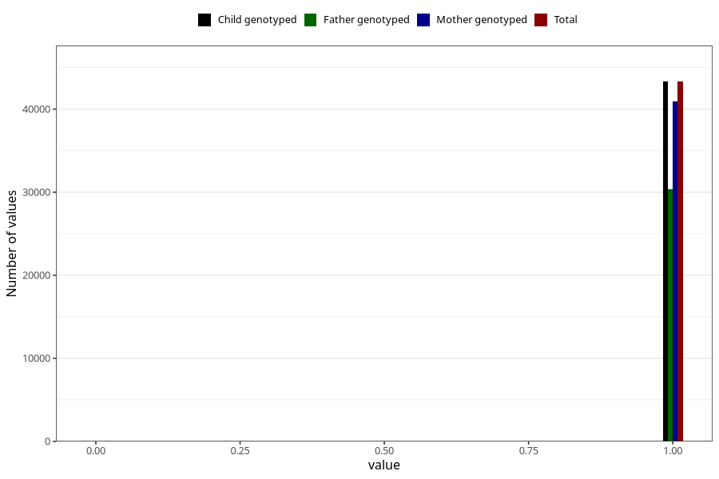

# trouble_relating_to_others_no_3y
Variable mapping to `GG578` in `Skjema6_3aar_v12`.
- Number of values:

| Value | Total | Child genotyped | Mother genotyped | Father genotyped |
| ----- | ----- | --------------- | ---------------- | ---------------- |
| Missing | 37670 | 37670 | 35643 | 23224 |
| Non-missing | 43335 | 43335 | 40974 | 30380 |
| 0 | 20 | 20 | 19 | 14 |
| 1 | 43315 | 43315 | 40955 | 30366 |

