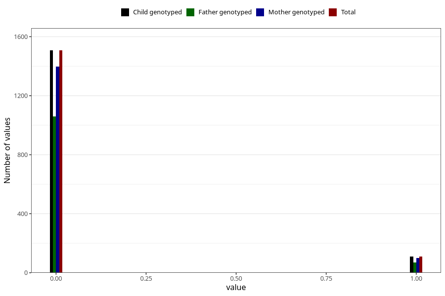

# trouble_relating_to_others_yes_3y
Variable mapping to `GG579` in `Skjema6_3aar_v12`.
- Number of values:

| Value | Total | Child genotyped | Mother genotyped | Father genotyped |
| ----- | ----- | --------------- | ---------------- | ---------------- |
| Missing | 79388 | 79388 | 75120 | 52474 |
| Non-missing | 1617 | 1617 | 1497 | 1130 |
| 0 | 1507 | 1507 | 1397 | 1059 |
| 1 | 110 | 110 | 100 | 71 |

