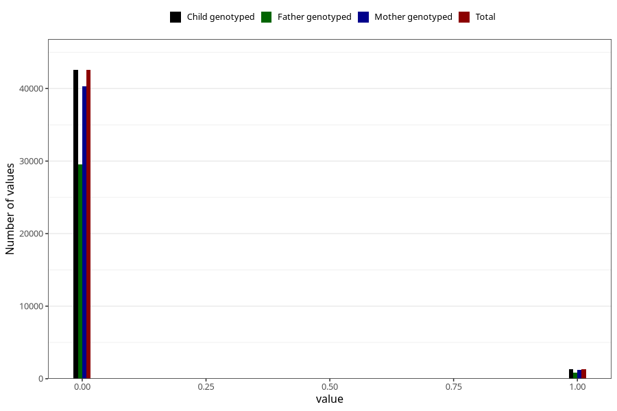

# underweight_3y
Variable created during phenotype curation.
- Number of values:

| Value | Total | Child genotyped | Mother genotyped | Father genotyped |
| ----- | ----- | --------------- | ---------------- | ---------------- |
| Missing | 37146 | 37146 | 35132 | 23143 |
| Non-missing | 43859 | 43859 | 41485 | 30461 |
| 0 | 42553 | 42553 | 40262 | 29583 |
| 1 | 1306 | 1306 | 1223 | 878 |

