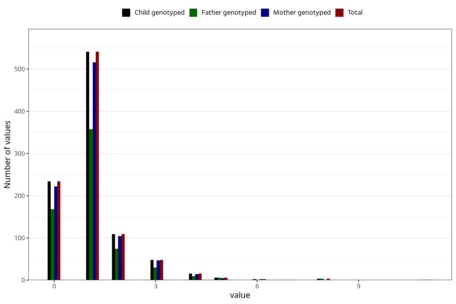

# urinary_tract_infection_number_6_11m
Variable mapping to `EE246` in `Skjema5_18mnd_v12`.
- Number of values:

| Value | Total | Child genotyped | Mother genotyped | Father genotyped |
| ----- | ----- | --------------- | ---------------- | ---------------- |
| Missing | 80045 | 80045 | 75704 | 52954 |
| Non-missing | 960 | 960 | 913 | 650 |
| 0 | 234 | 234 | 222 | 168 |
| 1 | 541 | 541 | 516 | 358 |
| 2 | 109 | 109 | 104 | 74 |
| 3 | 48 | 48 | 47 | 30 |
| 4 | 15 | 15 | 14 | 9 |
| 5 | 6 | 6 | 5 | 6 |
| 6 | 2 | 2 | 2 | 1 |
| 7 | 1 | 1 | 1 | 0 |
| 8 | 3 | 3 | 1 | 3 |
| 11 | 1 | 1 | 1 | 1 |

