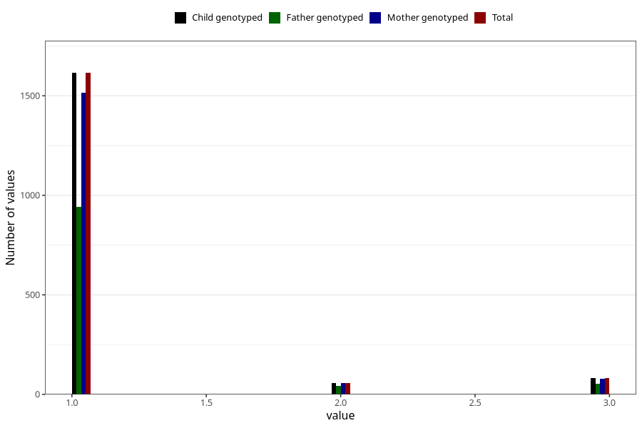

# vaccine_bcg_freq_18m
Variable mapping to `EE166` in `Skjema5_18mnd_v12`.
- Number of values:

| Value | Total | Child genotyped | Mother genotyped | Father genotyped |
| ----- | ----- | --------------- | ---------------- | ---------------- |
| Missing | 79252 | 79252 | 74968 | 52566 |
| Non-missing | 1753 | 1753 | 1649 | 1038 |
| 1 | 1615 | 1615 | 1515 | 941 |
| 2 | 57 | 57 | 57 | 42 |
| 3 | 81 | 81 | 77 | 55 |

