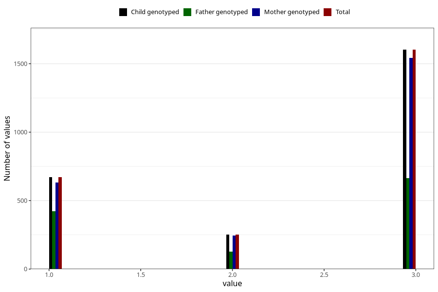

# vaccine_dt_freq_18m
Variable mapping to `EE154` in `Skjema5_18mnd_v12`.
- Number of values:

| Value | Total | Child genotyped | Mother genotyped | Father genotyped |
| ----- | ----- | --------------- | ---------------- | ---------------- |
| Missing | 78479 | 78479 | 74197 | 52389 |
| Non-missing | 2526 | 2526 | 2420 | 1215 |
| 1 | 671 | 671 | 634 | 424 |
| 2 | 253 | 253 | 244 | 128 |
| 3 | 1602 | 1602 | 1542 | 663 |

