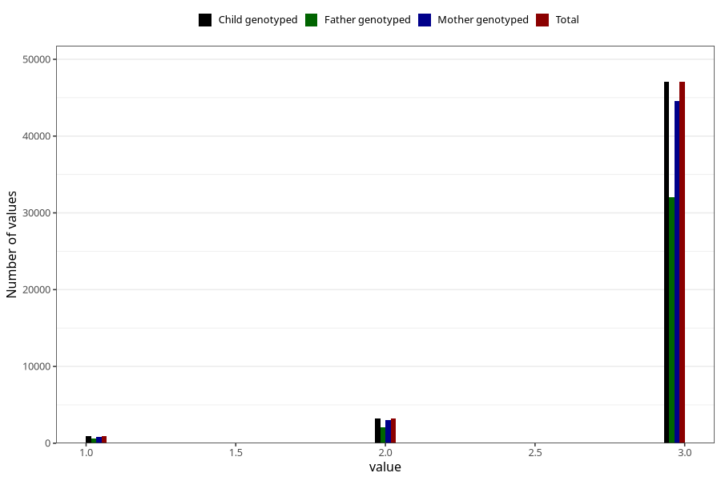

# vaccine_dtp_freq_18m
Variable mapping to `EE151` in `Skjema5_18mnd_v12`.
- Number of values:

| Value | Total | Child genotyped | Mother genotyped | Father genotyped |
| ----- | ----- | --------------- | ---------------- | ---------------- |
| Missing | 29812 | 29812 | 28115 | 18849 |
| Non-missing | 51193 | 51193 | 48502 | 34755 |
| 1 | 910 | 910 | 848 | 598 |
| 2 | 3229 | 3229 | 3056 | 2120 |
| 3 | 47054 | 47054 | 44598 | 32037 |

