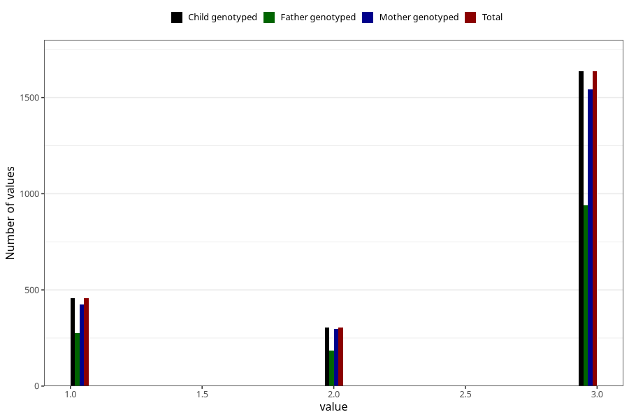

# vaccine_hepatitis_b_freq_18m
Variable mapping to `EE163` in `Skjema5_18mnd_v12`.
- Number of values:

| Value | Total | Child genotyped | Mother genotyped | Father genotyped |
| ----- | ----- | --------------- | ---------------- | ---------------- |
| Missing | 78608 | 78608 | 74353 | 52202 |
| Non-missing | 2397 | 2397 | 2264 | 1402 |
| 1 | 456 | 456 | 424 | 275 |
| 2 | 305 | 305 | 297 | 186 |
| 3 | 1636 | 1636 | 1543 | 941 |

