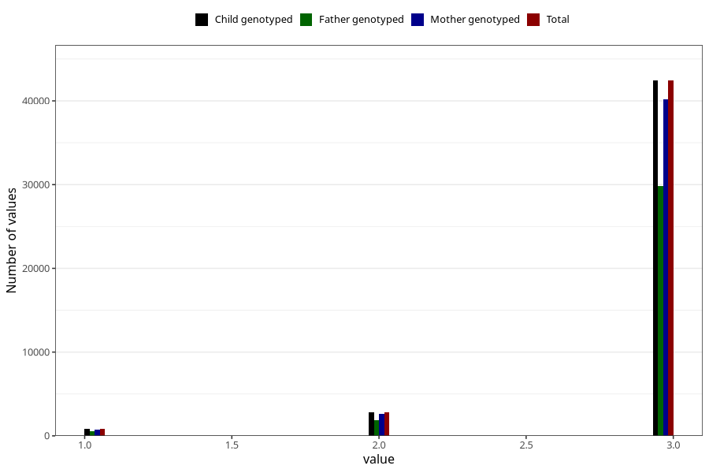

# vaccine_hib_freq_18m
Variable mapping to `EE784` in `Skjema5_18mnd_v12`.
- Number of values:

| Value | Total | Child genotyped | Mother genotyped | Father genotyped |
| ----- | ----- | --------------- | ---------------- | ---------------- |
| Missing | 34950 | 34950 | 33006 | 21344 |
| Non-missing | 46055 | 46055 | 43611 | 32260 |
| 1 | 832 | 832 | 781 | 565 |
| 2 | 2797 | 2797 | 2644 | 1893 |
| 3 | 42426 | 42426 | 40186 | 29802 |

