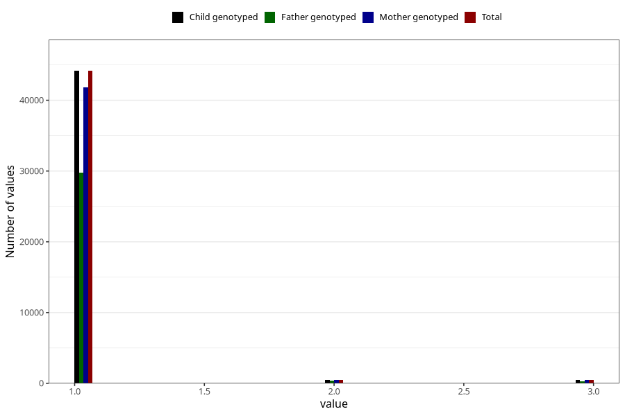

# vaccine_mmr_freq_18m
Variable mapping to `EE160` in `Skjema5_18mnd_v12`.
- Number of values:

| Value | Total | Child genotyped | Mother genotyped | Father genotyped |
| ----- | ----- | --------------- | ---------------- | ---------------- |
| Missing | 35812 | 35812 | 33792 | 23132 |
| Non-missing | 45193 | 45193 | 42825 | 30472 |
| 1 | 44153 | 44153 | 41849 | 29804 |
| 2 | 520 | 520 | 496 | 341 |
| 3 | 520 | 520 | 480 | 327 |

