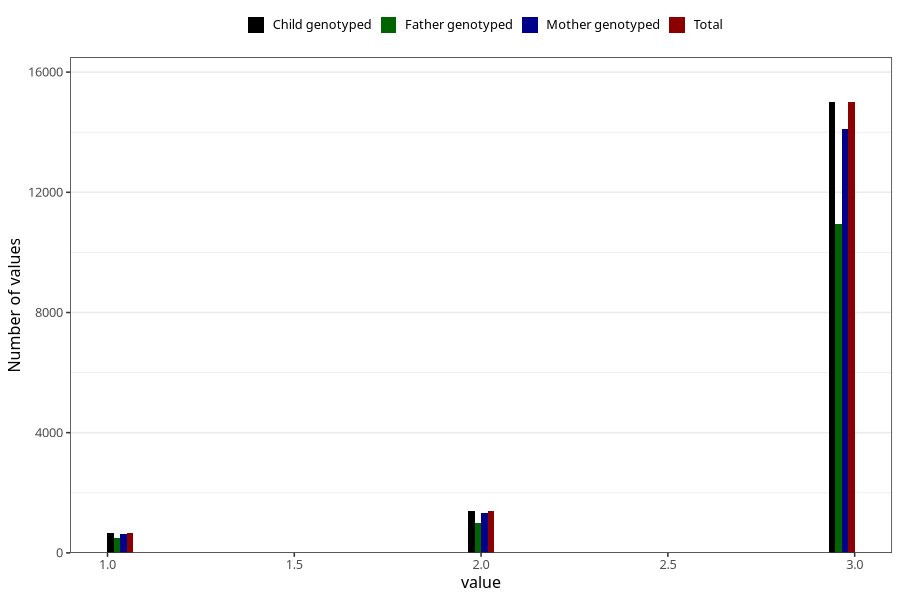

# vaccine_pneumococcus_freq_18m
Variable mapping to `EE1009` in `Skjema5_18mnd_v12`.
- Number of values:

| Value | Total | Child genotyped | Mother genotyped | Father genotyped |
| ----- | ----- | --------------- | ---------------- | ---------------- |
| Missing | 63947 | 63947 | 60579 | 41181 |
| Non-missing | 17058 | 17058 | 16038 | 12423 |
| 1 | 671 | 671 | 622 | 480 |
| 2 | 1389 | 1389 | 1315 | 1004 |
| 3 | 14998 | 14998 | 14101 | 10939 |

