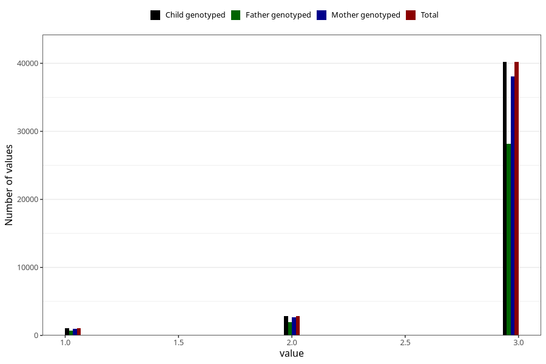

# vaccine_polio_freq_18m
Variable mapping to `EE956` in `Skjema5_18mnd_v12`.
- Number of values:

| Value | Total | Child genotyped | Mother genotyped | Father genotyped |
| ----- | ----- | --------------- | ---------------- | ---------------- |
| Missing | 36949 | 36949 | 34920 | 22857 |
| Non-missing | 44056 | 44056 | 41697 | 30747 |
| 1 | 1033 | 1033 | 962 | 691 |
| 2 | 2830 | 2830 | 2670 | 1921 |
| 3 | 40193 | 40193 | 38065 | 28135 |

