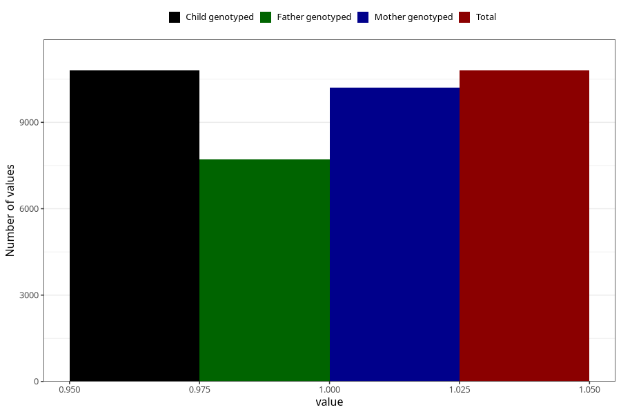

# youth_self_girl
Variable mapping to `UB225` in `Ungdomsskjema_Barn_v12_standard`.
- Number of values:

| Value | Total | Child genotyped | Mother genotyped | Father genotyped |
| ----- | ----- | --------------- | ---------------- | ---------------- |
| Missing | 70205 | 70205 | 66411 | 45884 |
| Non-missing | 10800 | 10800 | 10206 | 7720 |
| 1 | 10800 | 10800 | 10206 | 7720 |

