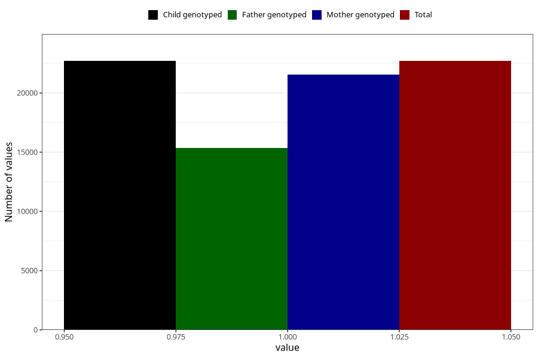

# breastmilk_12_14m
Variable mapping to `EE14` in `Skjema5_18mnd_v12`.
- Number of values:

| Value | Total | Child genotyped | Mother genotyped | Father genotyped |
| ----- | ----- | --------------- | ---------------- | ---------------- |
| Missing | 58308 | 58308 | 55089 | 38236 |
| Non-missing | 22697 | 22697 | 21528 | 15368 |
| 1 | 22697 | 22697 | 21528 | 15368 |

