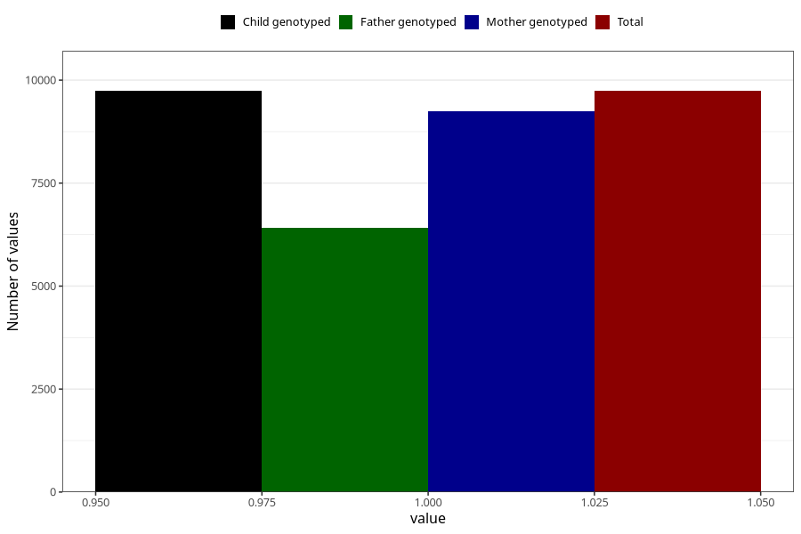

# breastmilk_15_18m
Variable mapping to `EE15` in `Skjema5_18mnd_v12`.
- Number of values:

| Value | Total | Child genotyped | Mother genotyped | Father genotyped |
| ----- | ----- | --------------- | ---------------- | ---------------- |
| Missing | 71267 | 71267 | 67366 | 47180 |
| Non-missing | 9738 | 9738 | 9251 | 6424 |
| 1 | 9738 | 9738 | 9251 | 6424 |

