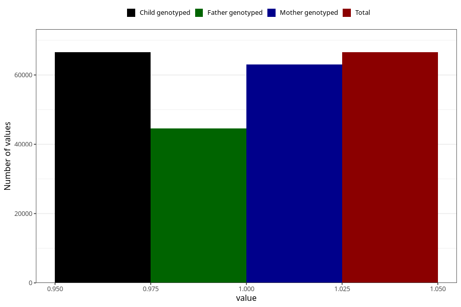

# breastmilk_1m
Variable mapping to `DD50` in `Skjema4_6mnd_v12`.
- Number of values:

| Value | Total | Child genotyped | Mother genotyped | Father genotyped |
| ----- | ----- | --------------- | ---------------- | ---------------- |
| Missing | 14457 | 14457 | 13566 | 8997 |
| Non-missing | 66548 | 66548 | 63051 | 44607 |
| 1 | 66548 | 66548 | 63051 | 44607 |

