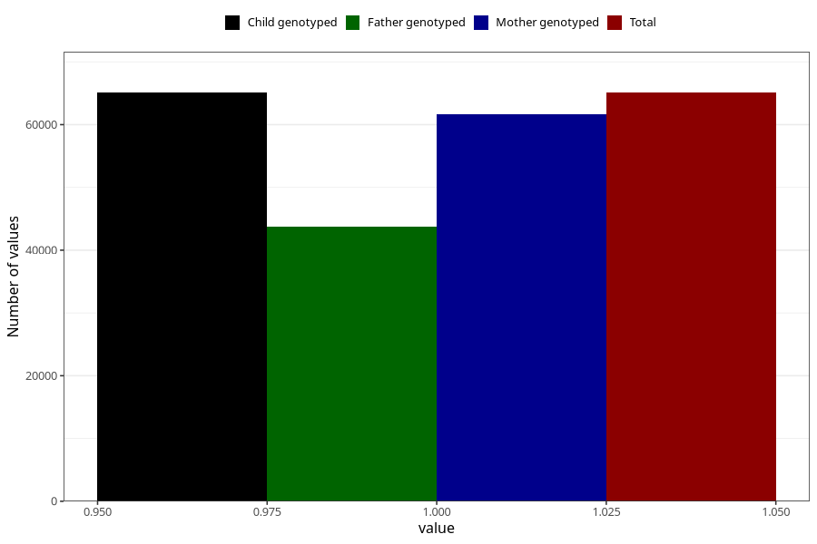

# breastmilk_2m
Variable mapping to `DD51` in `Skjema4_6mnd_v12`.
- Number of values:

| Value | Total | Child genotyped | Mother genotyped | Father genotyped |
| ----- | ----- | --------------- | ---------------- | ---------------- |
| Missing | 15912 | 15912 | 14945 | 9917 |
| Non-missing | 65093 | 65093 | 61672 | 43687 |
| 1 | 65093 | 65093 | 61672 | 43687 |

