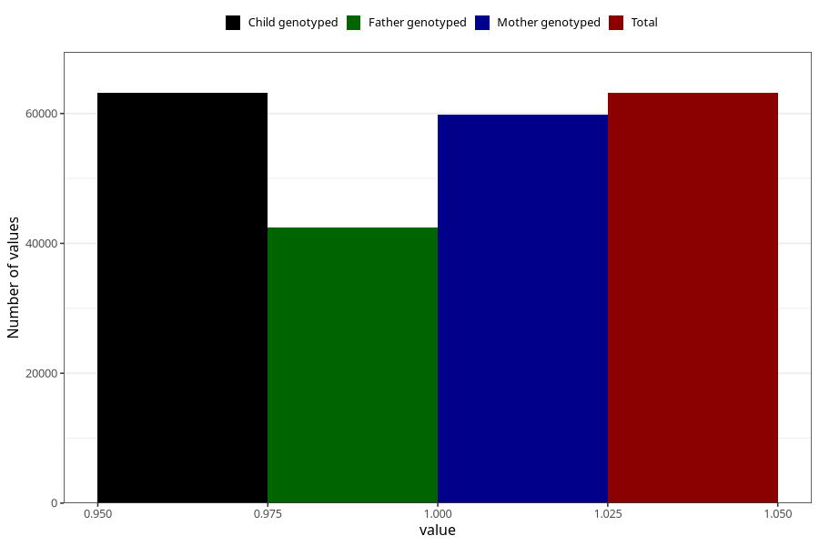

# breastmilk_3m
Variable mapping to `DD52` in `Skjema4_6mnd_v12`.
- Number of values:

| Value | Total | Child genotyped | Mother genotyped | Father genotyped |
| ----- | ----- | --------------- | ---------------- | ---------------- |
| Missing | 17848 | 17848 | 16762 | 11134 |
| Non-missing | 63157 | 63157 | 59855 | 42470 |
| 1 | 63157 | 63157 | 59855 | 42470 |

