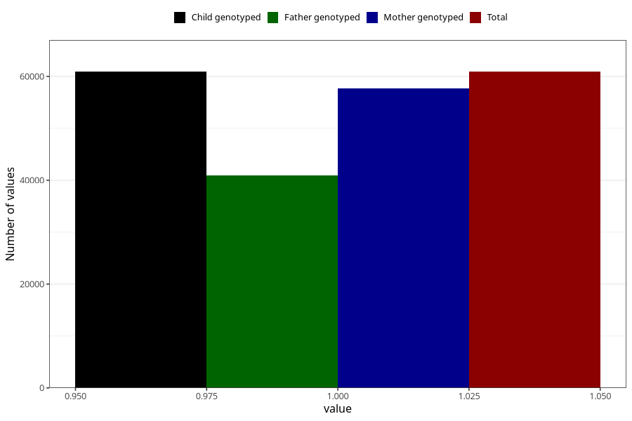

# breastmilk_4m
Variable mapping to `DD53` in `Skjema4_6mnd_v12`.
- Number of values:

| Value | Total | Child genotyped | Mother genotyped | Father genotyped |
| ----- | ----- | --------------- | ---------------- | ---------------- |
| Missing | 20100 | 20100 | 18882 | 12610 |
| Non-missing | 60905 | 60905 | 57735 | 40994 |
| 1 | 60905 | 60905 | 57735 | 40994 |

