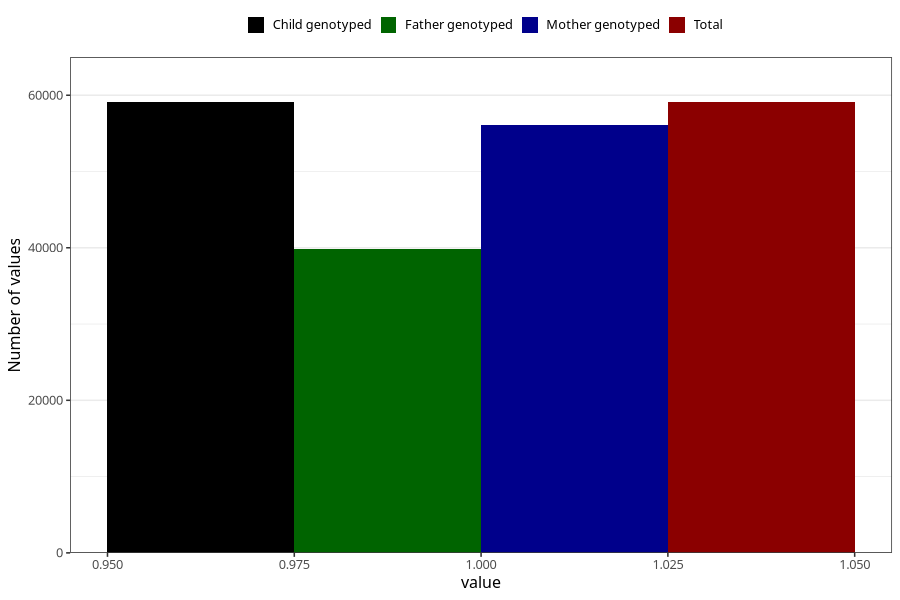

# breastmilk_5m
Variable mapping to `DD54` in `Skjema4_6mnd_v12`.
- Number of values:

| Value | Total | Child genotyped | Mother genotyped | Father genotyped |
| ----- | ----- | --------------- | ---------------- | ---------------- |
| Missing | 21920 | 21920 | 20583 | 13818 |
| Non-missing | 59085 | 59085 | 56034 | 39786 |
| 1 | 59085 | 59085 | 56034 | 39786 |

