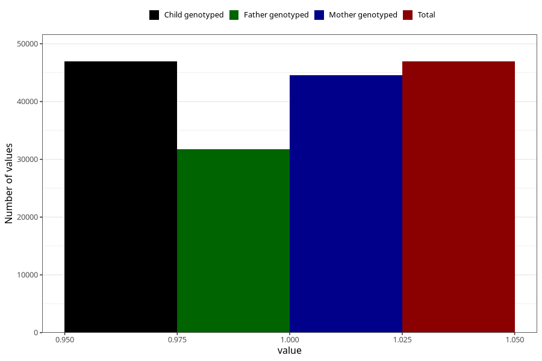

# breastmilk_6_8m
Variable mapping to `EE12` in `Skjema5_18mnd_v12`.
- Number of values:

| Value | Total | Child genotyped | Mother genotyped | Father genotyped |
| ----- | ----- | --------------- | ---------------- | ---------------- |
| Missing | 34077 | 34077 | 32102 | 21841 |
| Non-missing | 46928 | 46928 | 44515 | 31763 |
| 1 | 46928 | 46928 | 44515 | 31763 |

