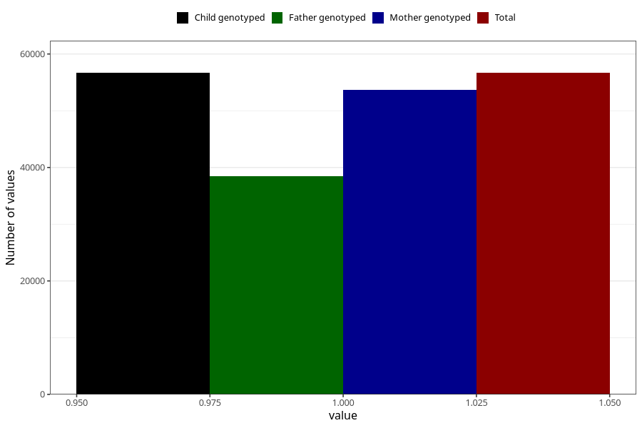

# breastmilk_6m
Variable mapping to `DD55` in `Skjema4_6mnd_v12`.
- Number of values:

| Value | Total | Child genotyped | Mother genotyped | Father genotyped |
| ----- | ----- | --------------- | ---------------- | ---------------- |
| Missing | 24335 | 24335 | 22884 | 15095 |
| Non-missing | 56670 | 56670 | 53733 | 38509 |
| 1 | 56670 | 56670 | 53733 | 38509 |

