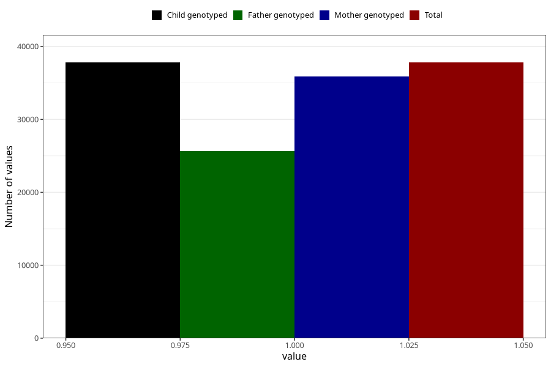

# breastmilk_9_11m
Variable mapping to `EE13` in `Skjema5_18mnd_v12`.
- Number of values:

| Value | Total | Child genotyped | Mother genotyped | Father genotyped |
| ----- | ----- | --------------- | ---------------- | ---------------- |
| Missing | 43203 | 43203 | 40732 | 27915 |
| Non-missing | 37802 | 37802 | 35885 | 25689 |
| 1 | 37802 | 37802 | 35885 | 25689 |

