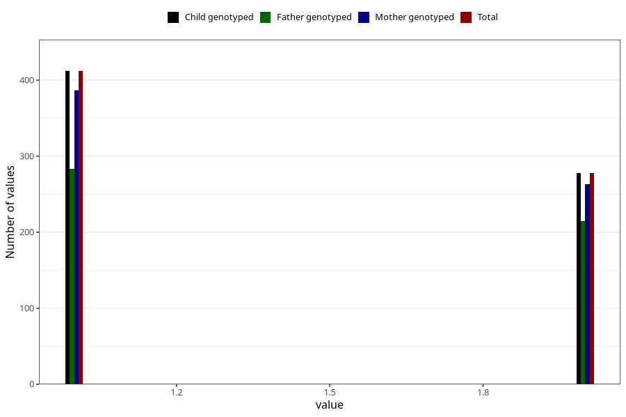

# fish_oil_capsules_amount_per_time_7y
Variable mapping to `JJ536` in `Skjema7aar_v12`.
Variable mapping to `JJ536` in `Skjema7aar_v12`.
- Number of values:

| Value | Total | Child genotyped | Mother genotyped | Father genotyped |
| ----- | ----- | --------------- | ---------------- | ---------------- |
| Missing | 80306 | 80306 | 75959 | 53100 |
| Non-missing | 699 | 699 | 658 | 504 |
| 3+ at a time | 9 | 9 | 8 |6 |
| 1 | 412 | 412 | 387 | 283 |
| 2 | 278 | 278 | 263 | 215 |

