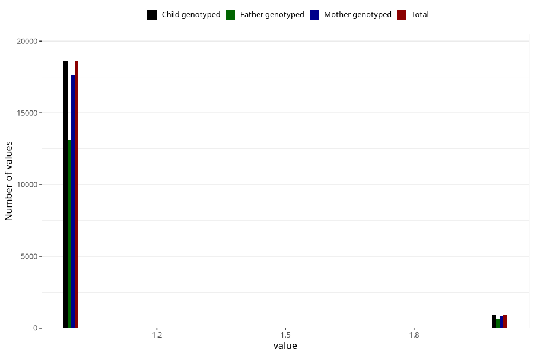

# fluoride_capsules_amount_per_time_7y
Variable mapping to `JJ540` in `Skjema7aar_v12`.
Variable mapping to `JJ540` in `Skjema7aar_v12`.
- Number of values:

| Value | Total | Child genotyped | Mother genotyped | Father genotyped |
| ----- | ----- | --------------- | ---------------- | ---------------- |
| Missing | 61433 | 61433 | 58113 | 39833 |
| Non-missing | 19572 | 19572 | 18504 | 13771 |
| 3+ at a time | 21 | 21 | 17 |16 |
| More than 1 check box filled in | 5 | 5 | 4 |4 |
| 1 | 18637 | 18637 | 17632 | 13108 |
| 2 | 909 | 909 | 851 | 643 |

