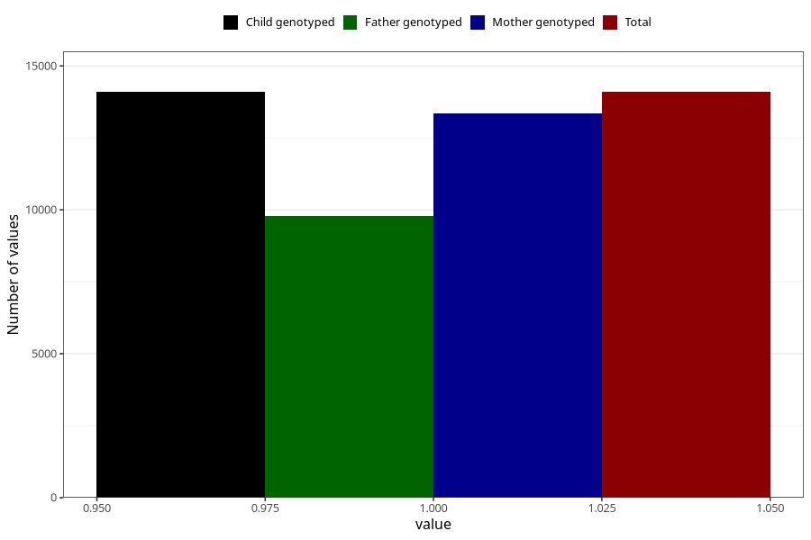

# formula_12_14m
Variable mapping to `EE18` in `Skjema5_18mnd_v12`.
- Number of values:

| Value | Total | Child genotyped | Mother genotyped | Father genotyped |
| ----- | ----- | --------------- | ---------------- | ---------------- |
| Missing | 66911 | 66911 | 63277 | 43827 |
| Non-missing | 14094 | 14094 | 13340 | 9777 |
| 1 | 14094 | 14094 | 13340 | 9777 |

