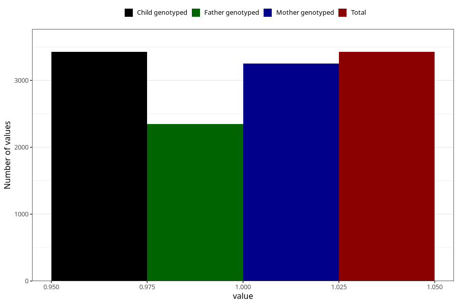

# formula_15_18m
Variable mapping to `EE19` in `Skjema5_18mnd_v12`.
- Number of values:

| Value | Total | Child genotyped | Mother genotyped | Father genotyped |
| ----- | ----- | --------------- | ---------------- | ---------------- |
| Missing | 77579 | 77579 | 73368 | 51255 |
| Non-missing | 3426 | 3426 | 3249 | 2349 |
| 1 | 3426 | 3426 | 3249 | 2349 |

