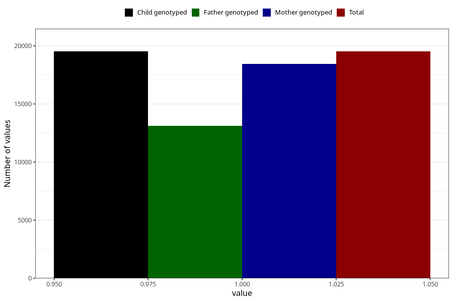

# formula_6_8m
Variable mapping to `EE16` in `Skjema5_18mnd_v12`.
- Number of values:

| Value | Total | Child genotyped | Mother genotyped | Father genotyped |
| ----- | ----- | --------------- | ---------------- | ---------------- |
| Missing | 61489 | 61489 | 58182 | 40482 |
| Non-missing | 19516 | 19516 | 18435 | 13122 |
| 1 | 19516 | 19516 | 18435 | 13122 |

