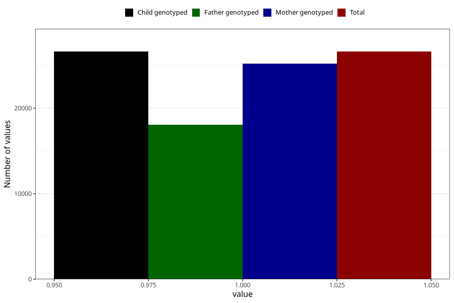

# formula_9_11m
Variable mapping to `EE17` in `Skjema5_18mnd_v12`.
- Number of values:

| Value | Total | Child genotyped | Mother genotyped | Father genotyped |
| ----- | ----- | --------------- | ---------------- | ---------------- |
| Missing | 54381 | 54381 | 51427 | 35549 |
| Non-missing | 26624 | 26624 | 25190 | 18055 |
| 1 | 26624 | 26624 | 25190 | 18055 |

