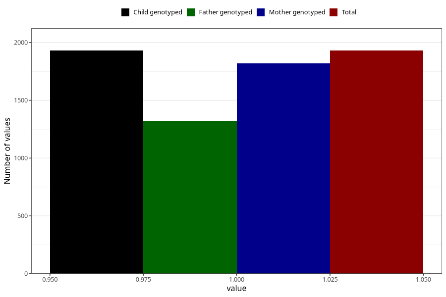

# formula_colett_0m
Variable mapping to `DD56` in `Skjema4_6mnd_v12`.
- Number of values:

| Value | Total | Child genotyped | Mother genotyped | Father genotyped |
| ----- | ----- | --------------- | ---------------- | ---------------- |
| Missing | 79075 | 79075 | 74797 | 52283 |
| Non-missing | 1930 | 1930 | 1820 | 1321 |
| 1 | 1930 | 1930 | 1820 | 1321 |

