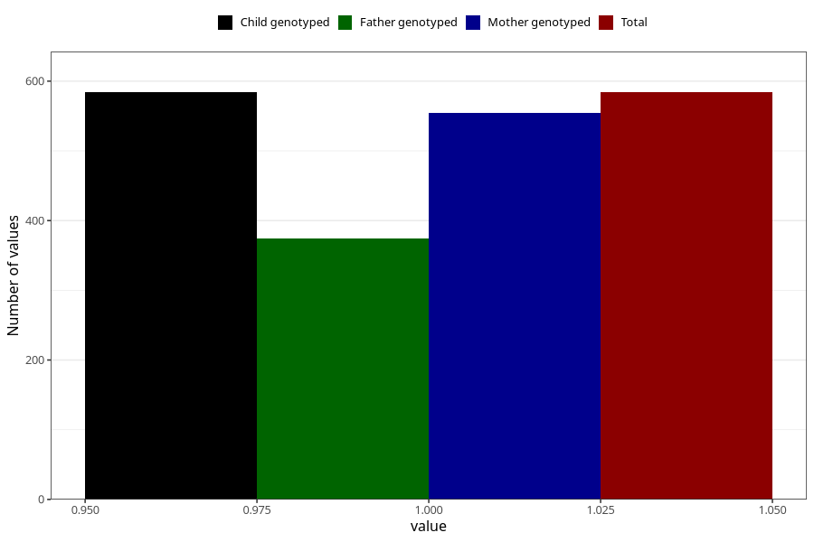

# formula_colett_1m
Variable mapping to `DD57` in `Skjema4_6mnd_v12`.
- Number of values:

| Value | Total | Child genotyped | Mother genotyped | Father genotyped |
| ----- | ----- | --------------- | ---------------- | ---------------- |
| Missing | 80421 | 80421 | 76063 | 53230 |
| Non-missing | 584 | 584 | 554 | 374 |
| 1 | 584 | 584 | 554 | 374 |

